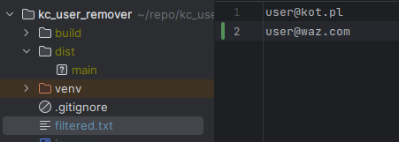
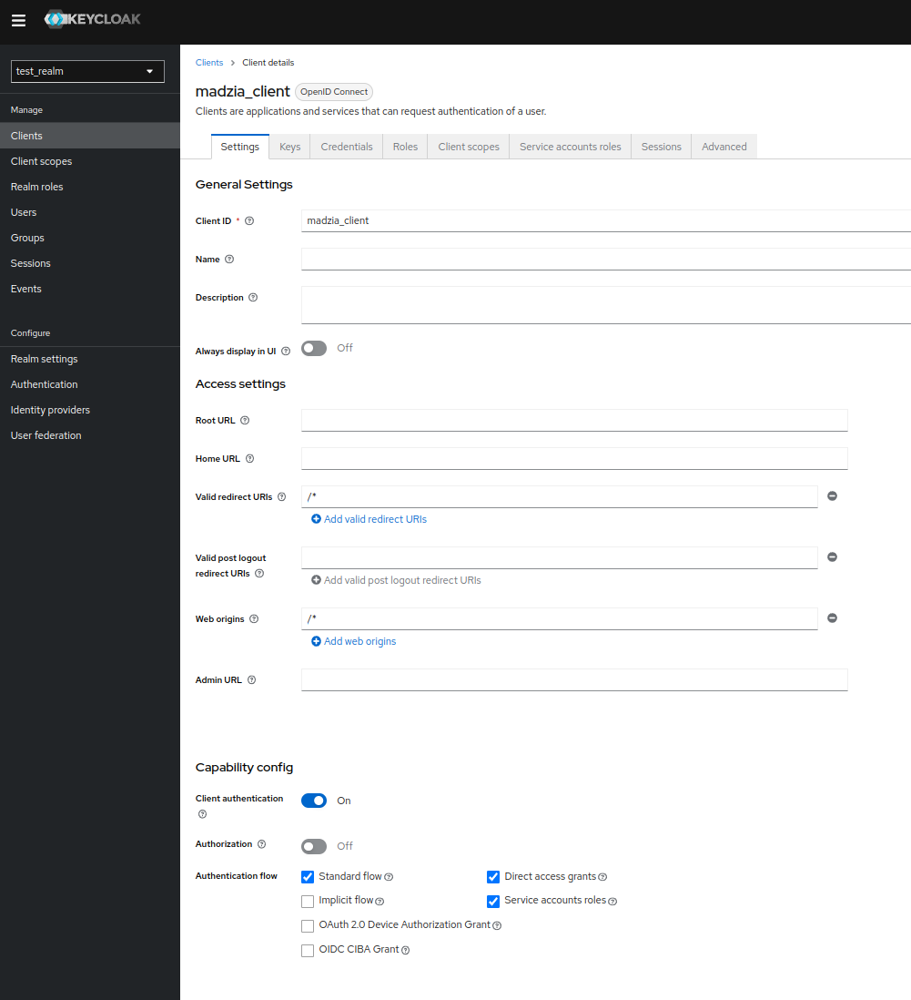
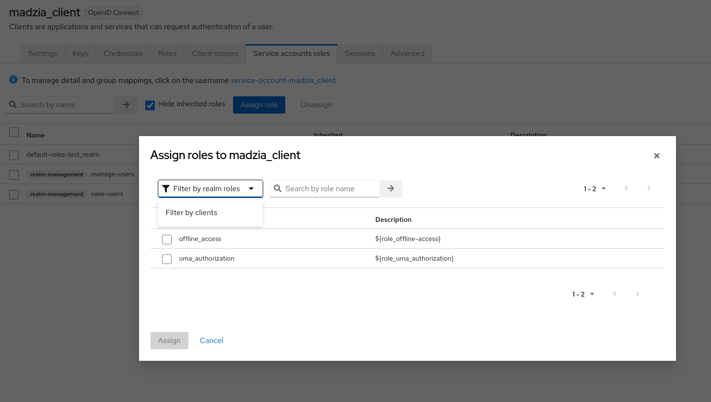
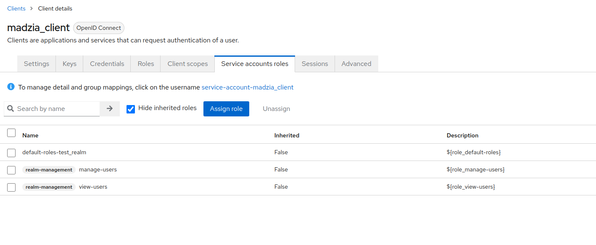
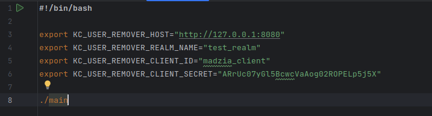

# Keycloak user remover

## Setting up structure

Files:
- `main`
- `run.sh`
- `filtered.txt`

must be in one directory.

## Excluding emails

To exclude emails, add email addresses one per row in `filtered.txt`.

Algorithm will compare emails taken from Keycloak with list in `filtered.txt` and exclude those that match.

## Setting up client

Create new client with any name.
- enable "Client Authentication"
- enable 'Standard Flow'
- enable 'Service account roles'

Now save/create client.

Should look like this: (`Direct access grant` is not used, can be disabled)



Head up to `Service Account Roles` tab.

Click `Assign role`.

Change filter from `Filter by realm roles` to `Filter by clients`. 


Then search in search box for roles:
- view-users
- manage-users

Should look like this:


Everything is set up!

## Executing program

Fill variables in `run.sh` script, they are as follows:

- KC_USER_REMOVER_HOST - Keycloak host, the server address, for example: http://keycloak.dev.pl
- KC_USER_REMOVER_REALM_NAME - Keycloak's realm name you work on
- KC_USER_REMOVER_CLIENT_ID - name of your created client, in my example it is `madzia_client`
- KC_USER_REMOVER_CLIENT_SECRET - secret fot that client (in client view in Keycloak console head to `Credentials` and copy `secret` - click eye to reveal it)

My example:



Now open terminal and run `chmod u+x run.sh main`. That command will make both file executable.

Finally, run `./run.sh`.

Running example with one ignored, one removed user.
```commandline
$ ./run.sh
Ignoring user: user@kot.pl
Removed user: krzysio_kodzi@pocztya.com
```

